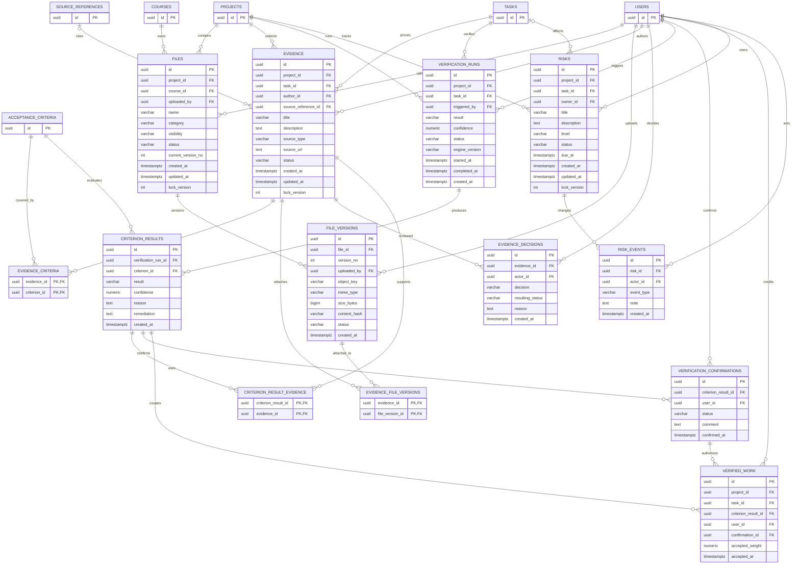

# GroupProof 数据库 ER 图

> 版本：v1.0（逻辑模型）  
> 更新时间：2026-10-10  
> 适用范围：V1 完整业务模型；首次数据库迁移只落地文末列出的核心子集。

这份文档是数据库的逻辑 ER 模型。四张 Mermaid 图合起来构成完整模型：

1. 身份、课程、小组、项目和任务计划；
2. 文件、证据、验收和风险；
3. GitHub、飞书、讨论和通知；
4. 贡献、申诉、报告、导出、权限和审计。

## 可视化预览

- [01 核心身份、课程、项目与计划](./erd-preview/01-core.svg)
- [02 文件、证据、验收与风险](./erd-preview/02-evidence.svg)
- [03 GitHub、飞书、讨论和通知](./erd-preview/03-integrations.svg)
- [04 贡献、报告、治理和审计](./erd-preview/04-governance.svg)

飞书上传版（PNG，宽度 `3136px`）：

- [01 核心身份、课程、项目与计划](./erd-preview/feishu/01-core.png)
- [02 文件、证据、验收与风险](./erd-preview/feishu/02-evidence.png)
- [03 GitHub、飞书、讨论和通知](./erd-preview/feishu/03-integrations.png)
- [04 贡献、报告、治理和审计](./erd-preview/feishu/04-governance.png)

## 统一约定

- 表名和字段名使用 `snake_case`，表名使用复数。
- 主键使用 PostgreSQL `uuid`，默认值为 `gen_random_uuid()`。前端 Mock 的 `project-1` 等字符串只作为 seed 的 `external_key`，不作为生产主键。
- 时间字段使用 `timestamptz`。数据库连接、API 序列化、前端展示和定时任务统一使用 `Asia/Shanghai`（北京时间，UTC+8），API 示例格式为 `2026-10-10T14:30:00+08:00`。
- `lock_version` 用于乐观锁；`version_no` 用于基线、计划、报告等业务快照版本，两个概念不混用。
- 状态字段使用 `varchar` 加 PostgreSQL `CHECK` 约束。百分比使用 `smallint` 并限制在 `0..100`；比例和权重使用 `numeric`。
- 多对多关系不存数组，使用关联表；`jsonb` 只用于外部原文、快照和不会参与外键连接的扩展元数据。
- 证据、验收、贡献快照、审计日志等历史数据不物理删除，使用状态或新版本保留轨迹。
- Mermaid 字段标记：`PK` 主键，`FK` 外键，`UK` 唯一键。未标记为 `FK` 的 `target_id` 属于多态目标，只由服务层校验。

## 1. 身份、课程、项目与计划

```mermaid
erDiagram
    USERS {
        uuid id PK
        varchar name
        varchar username UK
        varchar email UK
        varchar student_id UK
        varchar college
        varchar global_role
        varchar status
        timestamptz email_verified_at
        varchar avatar_color
        timestamptz created_at
        timestamptz updated_at
        int lock_version
    }

    SESSIONS {
        uuid id PK
        uuid user_id FK
        varchar provider
        varchar refresh_token_hash
        timestamptz expires_at
        timestamptz last_seen_at
        timestamptz revoked_at
        timestamptz created_at
    }

    EMAIL_VERIFICATIONS {
        uuid id PK
        uuid user_id FK
        varchar email
        varchar purpose
        varchar code_hash
        timestamptz expires_at
        timestamptz verified_at
        int attempts
        timestamptz created_at
    }

    OAUTH_CONNECTIONS {
        uuid id PK
        uuid user_id FK
        varchar provider
        varchar provider_subject
        text access_token_encrypted
        text refresh_token_encrypted
        jsonb scopes_json
        timestamptz token_expires_at
        timestamptz created_at
        timestamptz updated_at
    }

    COURSES {
        uuid id PK
        uuid owner_id FK
        varchar code
        varchar name
        varchar college
        varchar semester
        varchar status
        timestamptz project_deadline
        timestamptz formation_deadline
        varchar grouping_mode
        smallint min_group_size
        smallint max_group_size
        timestamptz created_at
        timestamptz updated_at
        int lock_version
    }

    COURSE_STAFF {
        uuid course_id PK, FK
        uuid user_id PK, FK
        varchar role
        timestamptz joined_at
        timestamptz left_at
        timestamptz created_at
    }

    COURSE_MEMBERS {
        uuid id PK
        uuid course_id FK
        uuid user_id FK
        varchar role
        varchar status
        timestamptz joined_at
        timestamptz left_at
        timestamptz created_at
        timestamptz updated_at
        int lock_version
    }

    COURSE_RULE_VERSIONS {
        uuid id PK
        uuid course_id FK
        int version_no
        jsonb rules_json
        timestamptz effective_at
        uuid created_by FK
        boolean is_current
        timestamptz created_at
    }

    COURSE_REQUIRED_FILES {
        uuid id PK
        uuid course_id FK
        uuid rule_version_id FK
        varchar name
        text description
        jsonb allowed_types
        boolean required
        timestamptz created_at
    }

    MILESTONE_TEMPLATES {
        uuid id PK
        uuid course_id FK
        uuid rule_version_id FK
        varchar title
        text description
        int deadline_offset_days
        int sort_order
        timestamptz created_at
    }

    GROUPS {
        uuid id PK
        uuid course_id FK
        uuid leader_id FK
        varchar name
        varchar direction
        boolean roster_frozen
        timestamptz created_at
        timestamptz updated_at
        int lock_version
    }

    GROUP_MEMBERS {
        uuid id PK
        uuid group_id FK
        uuid user_id FK
        varchar role
        timestamptz joined_at
        timestamptz left_at
        timestamptz created_at
    }

    PROJECTS {
        uuid id PK
        uuid course_id FK
        uuid group_id FK
        varchar name
        text description
        varchar project_type
        varchar language
        varchar visibility
        varchar setup_status
        smallint setup_step
        varchar lifecycle
        timestamptz final_deadline
        timestamptz archived_at
        timestamptz created_at
        timestamptz updated_at
        int lock_version
    }

    PROJECT_MEMBERS {
        uuid id PK
        uuid project_id FK
        uuid user_id FK
        varchar role
        timestamptz joined_at
        timestamptz left_at
        timestamptz created_at
    }

    PROJECT_VERSIONS {
        uuid id PK
        uuid project_id FK
        int version_no
        uuid source_project_version_id FK
        uuid created_by FK
        varchar reason
        jsonb snapshot_json
        timestamptz created_at
    }

    FUNCTIONAL_MODULES {
        uuid id PK
        uuid project_id FK
        uuid owner_id FK
        varchar name
        text description
        boolean core
        smallint progress_percent
        int sort_order
        timestamptz created_at
        timestamptz updated_at
        int lock_version
    }

    REQUIREMENTS {
        uuid id PK
        uuid project_id FK
        uuid module_id FK
        varchar title
        text description
        varchar priority
        varchar status
        varchar source_summary
        uuid created_by FK
        timestamptz created_at
        timestamptz updated_at
        int lock_version
    }

    SOURCE_REFERENCES {
        uuid id PK
        uuid project_id FK
        uuid created_by FK
        varchar source_type
        varchar external_id
        text source_uri
        varchar title
        varchar content_hash
        jsonb metadata_json
        timestamptz created_at
    }

    REQUIREMENT_SOURCE_REFERENCES {
        uuid requirement_id PK, FK
        uuid source_reference_id PK, FK
        varchar relation_type
    }

    REQUIREMENT_CONFLICTS {
        uuid id PK
        uuid project_id FK
        uuid left_requirement_id FK
        uuid right_requirement_id FK
        varchar conflict_type
        text description
        varchar status
        timestamptz created_at
        timestamptz updated_at
    }

    CONFLICT_RESOLUTIONS {
        uuid id PK
        uuid conflict_id FK
        uuid resolved_by FK
        varchar decision
        text reason
        timestamptz created_at
    }

    BASELINE_VERSIONS {
        uuid id PK
        uuid project_id FK
        int version_no
        uuid based_on_version_id FK
        uuid created_by FK
        varchar status
        jsonb snapshot_json
        timestamptz confirmed_at
        timestamptz frozen_at
        timestamptz created_at
        int lock_version
    }

    BASELINE_CONFIRMATIONS {
        uuid id PK
        uuid baseline_version_id FK
        uuid user_id FK
        varchar status
        text comment
        timestamptz confirmed_at
    }

    TASKS {
        uuid id PK
        uuid project_id FK
        uuid module_id FK
        uuid parent_task_id FK
        uuid created_by FK
        varchar title
        text description
        varchar priority
        numeric weight
        varchar status
        smallint progress_percent
        timestamptz started_at
        timestamptz completed_at
        timestamptz created_at
        timestamptz updated_at
        int lock_version
    }

    TASK_REQUIREMENTS {
        uuid task_id PK, FK
        uuid requirement_id PK, FK
        varchar relation_type
    }

    TASK_ASSIGNEES {
        uuid task_id PK, FK
        uuid user_id PK, FK
        varchar role
        timestamptz assigned_at
        timestamptz unassigned_at
    }

    TASK_DEPENDENCIES {
        uuid task_id PK, FK
        uuid depends_on_task_id PK, FK
        varchar dependency_type
        timestamptz created_at
    }

    ACCEPTANCE_CRITERIA {
        uuid id PK
        uuid task_id FK
        varchar criterion_key
        text text
        numeric weight
        int sort_order
        timestamptz created_at
        timestamptz updated_at
        int lock_version
    }

    MILESTONES {
        uuid id PK
        uuid project_id FK
        varchar title
        text description
        timestamptz deadline
        varchar status
        smallint progress_percent
        int sort_order
        timestamptz created_at
        timestamptz updated_at
        int lock_version
    }

    TASK_MILESTONES {
        uuid task_id PK, FK
        uuid milestone_id PK, FK
    }

    PLAN_VERSIONS {
        uuid id PK
        uuid project_id FK
        int version_no
        uuid based_on_version_id FK
        uuid created_by FK
        varchar status
        jsonb snapshot_json
        timestamptz confirmed_at
        timestamptz frozen_at
        timestamptz created_at
        int lock_version
    }

    PLAN_CONFIRMATIONS {
        uuid id PK
        uuid plan_version_id FK
        uuid user_id FK
        varchar status
        text comment
        timestamptz confirmed_at
    }

    PROGRESS_EVENTS {
        uuid id PK
        uuid project_id FK
        uuid task_id FK
        uuid actor_id FK
        varchar from_status
        varchar to_status
        smallint progress_before
        smallint progress_after
        text reason
        timestamptz created_at
    }

    USERS ||--o{ SESSIONS : owns
    USERS ||--o{ EMAIL_VERIFICATIONS : verifies
    USERS ||--o{ OAUTH_CONNECTIONS : connects
    USERS ||--o{ COURSES : owns
    USERS ||--o{ COURSE_STAFF : teaches
    USERS ||--o{ COURSE_MEMBERS : joins
    COURSES ||--o{ COURSE_STAFF : has
    COURSES ||--o{ COURSE_MEMBERS : has
    COURSES ||--o{ COURSE_RULE_VERSIONS : versions
    COURSE_RULE_VERSIONS ||--o{ COURSE_REQUIRED_FILES : requires
    COURSE_RULE_VERSIONS ||--o{ MILESTONE_TEMPLATES : templates
    COURSES ||--o{ GROUPS : contains
    USERS o|--o{ GROUPS : leads
    GROUPS ||--o{ GROUP_MEMBERS : has
    USERS ||--o{ GROUP_MEMBERS : participates
    COURSES o|--o{ PROJECTS : contains
    GROUPS o|--o| PROJECTS : owns
    PROJECTS ||--o{ PROJECT_MEMBERS : includes
    USERS ||--o{ PROJECT_MEMBERS : participates
    PROJECTS ||--o{ PROJECT_VERSIONS : versions
    PROJECT_VERSIONS o|--o{ PROJECT_VERSIONS : derived_from
    PROJECTS ||--o{ FUNCTIONAL_MODULES : contains
    USERS ||--o{ FUNCTIONAL_MODULES : owns
    PROJECTS ||--o{ REQUIREMENTS : defines
    FUNCTIONAL_MODULES ||--o{ REQUIREMENTS : organizes
    USERS ||--o{ REQUIREMENTS : creates
    PROJECTS ||--o{ SOURCE_REFERENCES : cites
    REQUIREMENTS ||--o{ REQUIREMENT_SOURCE_REFERENCES : cites
    SOURCE_REFERENCES ||--o{ REQUIREMENT_SOURCE_REFERENCES : supports
    PROJECTS ||--o{ REQUIREMENT_CONFLICTS : detects
    REQUIREMENTS ||--o{ REQUIREMENT_CONFLICTS : conflicts
    REQUIREMENT_CONFLICTS ||--o{ CONFLICT_RESOLUTIONS : resolves
    USERS ||--o{ CONFLICT_RESOLUTIONS : decides
    PROJECTS ||--o{ BASELINE_VERSIONS : baselines
    BASELINE_VERSIONS o|--o{ BASELINE_VERSIONS : based_on
    BASELINE_VERSIONS ||--o{ BASELINE_CONFIRMATIONS : awaits
    USERS ||--o{ BASELINE_CONFIRMATIONS : confirms
    PROJECTS ||--o{ TASKS : contains
    FUNCTIONAL_MODULES ||--o{ TASKS : groups
    TASKS o|--o{ TASKS : parent_of
    USERS ||--o{ TASKS : creates
    TASKS ||--o{ TASK_REQUIREMENTS : links
    REQUIREMENTS ||--o{ TASK_REQUIREMENTS : linked_by
    TASKS ||--o{ TASK_ASSIGNEES : assigns
    USERS ||--o{ TASK_ASSIGNEES : responsible
    TASKS ||--o{ TASK_DEPENDENCIES : depends
    TASKS ||--o{ ACCEPTANCE_CRITERIA : checks
    PROJECTS ||--o{ MILESTONES : schedules
    TASKS ||--o{ TASK_MILESTONES : placed
    MILESTONES ||--o{ TASK_MILESTONES : contains
    PROJECTS ||--o{ PLAN_VERSIONS : plans
    PLAN_VERSIONS o|--o{ PLAN_VERSIONS : based_on
    PLAN_VERSIONS ||--o{ PLAN_CONFIRMATIONS : awaits
    USERS ||--o{ PLAN_CONFIRMATIONS : confirms
    PROJECTS ||--o{ PROGRESS_EVENTS : records
    TASKS ||--o{ PROGRESS_EVENTS : changes
    USERS ||--o{ PROGRESS_EVENTS : acts
```

## 2. 文件、证据、验收与风险

## 3. GitHub、飞书、讨论和通知

```mermaid
erDiagram
    PROJECTS { uuid id PK }
    USERS { uuid id PK }
    COURSES { uuid id PK }
    GROUPS { uuid id PK }
    TASKS { uuid id PK }
    REQUIREMENTS { uuid id PK }
    FUNCTIONAL_MODULES { uuid id PK }
    MILESTONES { uuid id PK }
    SOURCE_REFERENCES { uuid id PK }

    GITHUB_CONNECTIONS {
        uuid id PK
        uuid project_id FK
        uuid connected_by FK
        varchar owner
        varchar repository
        varchar installation_id
        varchar default_branch
        varchar status
        timestamptz connected_at
        timestamptz last_synced_at
        timestamptz created_at
        timestamptz updated_at
    }

    GITHUB_ACTIVITIES {
        uuid id PK
        uuid connection_id FK
        uuid project_id FK
        uuid task_id FK
        uuid source_reference_id FK
        varchar external_id
        varchar type
        varchar title
        varchar external_author
        uuid author_id FK
        varchar status
        text url
        timestamptz occurred_at
        jsonb payload_json
        timestamptz created_at
    }

    WEBHOOK_DELIVERIES {
        uuid id PK
        uuid connection_id FK
        varchar provider_delivery_id UK
        varchar event_type
        varchar status
        int attempts
        varchar payload_hash
        text last_error
        timestamptz received_at
        timestamptz processed_at
    }

    FEISHU_CONNECTIONS {
        uuid id PK
        uuid project_id FK
        uuid connected_by FK
        varchar tenant_id
        varchar app_id
        varchar chat_id
        varchar status
        timestamptz connected_at
        timestamptz last_synced_at
        timestamptz created_at
        timestamptz updated_at
    }

    FEISHU_RECORDS {
        uuid id PK
        uuid connection_id FK
        uuid project_id FK
        uuid task_id FK
        uuid author_id FK
        varchar external_id
        varchar group_name
        varchar type
        text summary
        varchar status
        text source_url
        timestamptz occurred_at
        jsonb payload_json
        timestamptz created_at
    }

    SYNC_JOBS {
        uuid id PK
        uuid project_id FK
        uuid github_connection_id FK
        uuid feishu_connection_id FK
        varchar integration_type
        varchar status
        varchar cursor
        int attempts
        text error_message
        timestamptz started_at
        timestamptz completed_at
        timestamptz created_at
    }

    DISCUSSIONS {
        uuid id PK
        uuid project_id FK
        uuid author_id FK
        uuid task_id FK
        uuid requirement_id FK
        uuid module_id FK
        uuid milestone_id FK
        varchar title
        text body
        boolean is_important
        varchar status
        timestamptz created_at
        timestamptz updated_at
        int lock_version
    }

    DISCUSSION_REPLIES {
        uuid id PK
        uuid discussion_id FK
        uuid author_id FK
        text body
        timestamptz created_at
        timestamptz updated_at
    }

    NOTIFICATIONS {
        uuid id PK
        uuid user_id FK
        uuid course_id FK
        uuid project_id FK
        varchar type
        varchar title
        text description
        text href
        timestamptz read_at
        timestamptz created_at
    }

    NOTIFICATION_DELIVERIES {
        uuid id PK
        uuid notification_id FK
        varchar channel
        varchar status
        timestamptz sent_at
        timestamptz delivered_at
        text failure_reason
    }

    ACTION_ITEMS {
        uuid id PK
        uuid assignee_id FK
        uuid course_id FK
        uuid project_id FK
        uuid group_id FK
        uuid subject_user_id FK
        varchar type
        varchar change_kind
        varchar title
        text description
        varchar status
        varchar priority
        timestamptz due_at
        text href
        jsonb handoff_assignments
        timestamptz created_at
        timestamptz updated_at
        int lock_version
    }

    PROJECTS ||--o{ GITHUB_CONNECTIONS : connects
    USERS ||--o{ GITHUB_CONNECTIONS : configures
    GITHUB_CONNECTIONS ||--o{ GITHUB_ACTIVITIES : syncs
    PROJECTS ||--o{ GITHUB_ACTIVITIES : receives
    TASKS o|--o{ GITHUB_ACTIVITIES : links
    USERS o|--o{ GITHUB_ACTIVITIES : authors
    SOURCE_REFERENCES o|--o{ GITHUB_ACTIVITIES : cites
    GITHUB_CONNECTIONS ||--o{ WEBHOOK_DELIVERIES : receives
    PROJECTS ||--o{ FEISHU_CONNECTIONS : connects
    USERS ||--o{ FEISHU_CONNECTIONS : configures
    FEISHU_CONNECTIONS ||--o{ FEISHU_RECORDS : syncs
    PROJECTS ||--o{ FEISHU_RECORDS : receives
    TASKS o|--o{ FEISHU_RECORDS : links
    USERS o|--o{ FEISHU_RECORDS : authors
    PROJECTS ||--o{ SYNC_JOBS : schedules
    GITHUB_CONNECTIONS o|--o{ SYNC_JOBS : runs
    FEISHU_CONNECTIONS o|--o{ SYNC_JOBS : runs
    PROJECTS ||--o{ DISCUSSIONS : contains
    USERS ||--o{ DISCUSSIONS : starts
    TASKS o|--o{ DISCUSSIONS : discusses
    REQUIREMENTS o|--o{ DISCUSSIONS : discusses
    FUNCTIONAL_MODULES o|--o{ DISCUSSIONS : discusses
    MILESTONES o|--o{ DISCUSSIONS : discusses
    DISCUSSIONS ||--o{ DISCUSSION_REPLIES : has
    USERS ||--o{ DISCUSSION_REPLIES : writes
    USERS ||--o{ NOTIFICATIONS : receives
    PROJECTS o|--o{ NOTIFICATIONS : concerns
    NOTIFICATIONS ||--o{ NOTIFICATION_DELIVERIES : delivers
    USERS ||--o{ ACTION_ITEMS : assigned
    COURSES o|--o{ ACTION_ITEMS : concerns
    PROJECTS o|--o{ ACTION_ITEMS : concerns
    USERS o|--o{ ACTION_ITEMS : subjects
```

## 4. 贡献、报告、治理和审计

```mermaid
erDiagram
    USERS { uuid id PK }
    COURSES { uuid id PK }
    GROUPS { uuid id PK }
    PROJECTS { uuid id PK }
    TASKS { uuid id PK }
    EVIDENCE { uuid id PK }
    BASELINE_VERSIONS { uuid id PK }
    PLAN_VERSIONS { uuid id PK }
    ACTION_ITEMS { uuid id PK }

    TEACHER_REQUESTS {
        uuid id PK
        uuid user_id FK
        uuid course_id FK
        varchar status
        text reason
        uuid decided_by FK
        text decision_reason
        timestamptz submitted_at
        timestamptz decided_at
    }

    ACCESS_REQUESTS {
        uuid id PK
        uuid applicant_id FK
        varchar request_type
        varchar target_type
        uuid target_id
        varchar risk
        text reason
        varchar status
        uuid decided_by FK
        text decision_reason
        timestamptz submitted_at
        timestamptz decided_at
    }

    GROUP_CHANGE_REQUESTS {
        uuid id PK
        uuid group_id FK
        uuid applicant_id FK
        uuid subject_user_id FK
        varchar change_type
        text reason
        varchar status
        uuid decided_by FK
        text decision_reason
        timestamptz submitted_at
        timestamptz decided_at
    }

    CONTRIBUTION_CALCULATIONS {
        uuid id PK
        uuid project_id FK
        uuid created_by FK
        varchar algorithm_version
        varchar status
        varchar input_hash
        timestamptz started_at
        timestamptz completed_at
        timestamptz created_at
    }

    CONTRIBUTION_SNAPSHOTS {
        uuid id PK
        uuid project_id FK
        uuid calculation_id FK
        int version_no
        varchar status
        uuid created_by FK
        timestamptz frozen_at
        timestamptz created_at
    }

    CONTRIBUTION_ITEMS {
        uuid id PK
        uuid snapshot_id FK
        uuid user_id FK
        numeric task_credit
        numeric collaboration_credit
        numeric share
        numeric acceptance_rate
        varchar status
        text note
    }

    CONTRIBUTION_ITEM_TASKS {
        uuid contribution_item_id PK, FK
        uuid task_id PK, FK
        numeric ratio
    }

    CONTRIBUTION_ITEM_EVIDENCE {
        uuid contribution_item_id PK, FK
        uuid evidence_id PK, FK
    }

    APPEALS {
        uuid id PK
        uuid project_id FK
        uuid appellant_id FK
        uuid contribution_snapshot_id FK
        uuid task_id FK
        uuid evidence_id FK
        text reason
        varchar status
        timestamptz submitted_at
        timestamptz resolved_at
    }

    APPEAL_DECISIONS {
        uuid id PK
        uuid appeal_id FK
        uuid decided_by FK
        varchar decision
        numeric adjusted_share
        text reason
        timestamptz created_at
    }

    REPORTS {
        uuid id PK
        uuid project_id FK
        uuid created_by FK
        varchar status
        varchar current_format
        boolean includes_appendix
        timestamptz created_at
        timestamptz updated_at
        int lock_version
    }

    REPORT_SNAPSHOTS {
        uuid id PK
        uuid report_id FK
        uuid baseline_version_id FK
        uuid plan_version_id FK
        uuid contribution_snapshot_id FK
        int version_no
        varchar status
        jsonb content_json
        timestamptz finalized_at
        timestamptz created_at
    }

    REPORT_SECTIONS {
        uuid id PK
        uuid report_snapshot_id FK
        varchar section_key
        varchar title
        int sort_order
        timestamptz created_at
    }

    REPORT_SECTION_VERSIONS {
        uuid id PK
        uuid report_section_id FK
        int version_no
        uuid edited_by FK
        text body
        timestamptz created_at
    }

    EXPORT_JOBS {
        uuid id PK
        uuid report_snapshot_id FK
        uuid requested_by FK
        varchar format
        boolean includes_appendix
        varchar status
        text error_message
        timestamptz started_at
        timestamptz completed_at
        timestamptz created_at
    }

    EXPORT_ASSETS {
        uuid id PK
        uuid export_job_id FK
        varchar object_key
        varchar mime_type
        bigint size_bytes
        varchar checksum
        timestamptz expires_at
        timestamptz created_at
    }

    AUDIT_LOGS {
        uuid id PK
        uuid actor_id FK
        uuid request_id FK
        varchar action
        varchar target_type
        uuid target_id
        varchar result
        text reason
        inet ip
        jsonb detail_json
        timestamptz created_at
    }

    REQUEST_IDEMPOTENCY_KEYS {
        uuid id PK
        uuid user_id FK
        varchar request_id UK
        varchar method
        varchar route
        varchar request_hash
        varchar status
        int response_code
        jsonb response_json
        timestamptz expires_at
        timestamptz created_at
    }

    AI_USAGE_RECORDS {
        uuid id PK
        uuid project_id FK
        uuid user_id FK
        varchar workflow
        varchar provider
        varchar model
        int calls
        int failures
        int input_tokens
        int output_tokens
        int avg_latency_ms
        numeric cost
        timestamptz created_at
    }

    USERS ||--o{ TEACHER_REQUESTS : submits
    COURSES ||--o{ TEACHER_REQUESTS : receives
    USERS o|--o{ TEACHER_REQUESTS : decides
    USERS ||--o{ ACCESS_REQUESTS : submits
    USERS o|--o{ ACCESS_REQUESTS : decides
    GROUPS ||--o{ GROUP_CHANGE_REQUESTS : changes
    USERS ||--o{ GROUP_CHANGE_REQUESTS : submits
    USERS o|--o{ GROUP_CHANGE_REQUESTS : subjects
    USERS o|--o{ GROUP_CHANGE_REQUESTS : decides
    PROJECTS ||--o{ CONTRIBUTION_CALCULATIONS : calculates
    USERS ||--o{ CONTRIBUTION_CALCULATIONS : starts
    CONTRIBUTION_CALCULATIONS ||--o{ CONTRIBUTION_SNAPSHOTS : produces
    PROJECTS ||--o{ CONTRIBUTION_SNAPSHOTS : freezes
    USERS ||--o{ CONTRIBUTION_SNAPSHOTS : creates
    CONTRIBUTION_SNAPSHOTS ||--o{ CONTRIBUTION_ITEMS : contains
    USERS ||--o{ CONTRIBUTION_ITEMS : receives
    CONTRIBUTION_ITEMS ||--o{ CONTRIBUTION_ITEM_TASKS : allocates
    TASKS ||--o{ CONTRIBUTION_ITEM_TASKS : contributes
    CONTRIBUTION_ITEMS ||--o{ CONTRIBUTION_ITEM_EVIDENCE : explains
    EVIDENCE ||--o{ CONTRIBUTION_ITEM_EVIDENCE : supports
    PROJECTS ||--o{ APPEALS : receives
    USERS ||--o{ APPEALS : submits
    CONTRIBUTION_SNAPSHOTS ||--o{ APPEALS : challenged
    TASKS o|--o{ APPEALS : concerns
    EVIDENCE o|--o{ APPEALS : cites
    APPEALS ||--o{ APPEAL_DECISIONS : decides
    USERS ||--o{ APPEAL_DECISIONS : decides
    PROJECTS ||--o{ REPORTS : publishes
    USERS ||--o{ REPORTS : creates
    REPORTS ||--o{ REPORT_SNAPSHOTS : versions
    BASELINE_VERSIONS o|--o{ REPORT_SNAPSHOTS : sources
    PLAN_VERSIONS o|--o{ REPORT_SNAPSHOTS : sources
    CONTRIBUTION_SNAPSHOTS o|--o{ REPORT_SNAPSHOTS : sources
    REPORT_SNAPSHOTS ||--o{ REPORT_SECTIONS : contains
    REPORT_SECTIONS ||--o{ REPORT_SECTION_VERSIONS : edits
    USERS ||--o{ REPORT_SECTION_VERSIONS : edits
    REPORT_SNAPSHOTS ||--o{ EXPORT_JOBS : exports
    USERS ||--o{ EXPORT_JOBS : requests
    EXPORT_JOBS ||--o{ EXPORT_ASSETS : produces
    USERS ||--o{ AUDIT_LOGS : acts
    REQUEST_IDEMPOTENCY_KEYS ||--o{ AUDIT_LOGS : traces
    USERS ||--o{ REQUEST_IDEMPOTENCY_KEYS : sends
    PROJECTS o|--o{ AI_USAGE_RECORDS : consumes
    USERS o|--o{ AI_USAGE_RECORDS : triggers
```

## 关系和约束说明

### 关键唯一性

- `users.username`、`users.email`、`users.student_id`（非空时）唯一。
- `course_members` 的 `(course_id, user_id)` 唯一；活跃成员使用部分唯一索引 `WHERE left_at IS NULL`。
- `group_members`、`project_members` 同样使用活跃成员部分唯一索引。
- 一个小组最多一个项目：`projects.group_id` 使用可空唯一索引。
- 同一课程的课程编号和学期唯一：`courses(code, semester)`。
- 一个任务不能依赖自己；任务依赖关系不能形成环，这一项由服务层校验。
- 同一证据不能重复采纳同一验收标准；同一验收结果对同一用户只能确认一次。
- 同一报告快照的 `version_no`、同一贡献快照的 `version_no`、同一计划/基线版本的 `version_no` 在项目内唯一。
- GitHub/飞书外部事件使用 `(connection_id, external_id)` 幂等；Webhook 使用 `provider_delivery_id` 唯一。

### 并发和状态

1. 更新可变表时，API 必须携带 `expected_version`，执行 `WHERE id = :id AND lock_version = :expected_version`；更新零行返回 `409 Conflict`。
2. 证据撤回、验收过期、贡献冻结和项目归档只追加状态或新版本，不覆盖历史记录。
3. `progress_percent` 是可缓存的聚合值；任务进度是直接输入，模块、里程碑和项目进度由任务/验收事件重新计算。
4. `target_type + target_id` 这类多态目标没有数据库外键，必须在 API 权限校验和审计日志中验证目标存在且属于当前上下文。
5. 文件表只保存对象存储的 `object_key`、哈希、大小和 MIME；二进制内容放在 Supabase Storage。

## 首次迁移范围

完整 ER 图不等于一次性创建所有表。建议按以下顺序迁移，每个阶段都可独立回滚：

| 迁移 | 内容 | 负责范围 |
|---|---|---|
| 001 | `pgcrypto`、`vector` 扩展、时区和基础枚举约束 | A |
| 002 | `users`、`courses`、`course_staff`、`course_members` | A/D |
| 003 | `groups`、`group_members`、`projects`、`project_members` | A/D |
| 004 | `functional_modules`、`requirements`、`source_references`、`milestones` | B |
| 005 | `tasks`、任务关联表、`acceptance_criteria`、`progress_events` | B |
| 006 | `baseline_versions`、`baseline_confirmations`、`plan_versions`、`plan_confirmations` | B |
| 007 | `files`、`file_versions`、`evidence`、`verification_*`、`verified_work` | B/C |
| 008 | GitHub/飞书同步、讨论、通知、行动项 | C/A |
| 009 | 贡献、申诉、报告、导出、教师请求和审计 | D/A |

首次迁移完成后，应至少能在干净数据库中创建这条闭环：

`course -> group -> project -> module -> requirement -> task -> acceptance_criterion`

随后再按成员负责的领域补充证据、验收、同步、贡献和报告表。`pgvector` 先只启用扩展，等 embedding provider 和向量维度确定后再增加具体向量列或索引。

## Mermaid 与 Figma

这份 ER 图优先使用 Mermaid，因为它能随代码一起审查、版本化和更新。可以直接复制每个 `mermaid` 代码块到 Mermaid Live Editor 或支持 Mermaid 的文档中；需要 Figma 视觉稿时，再将渲染结果导入 Figma 进行排版。Figma 中的视觉调整不应替代这份 Mermaid 源文件。
